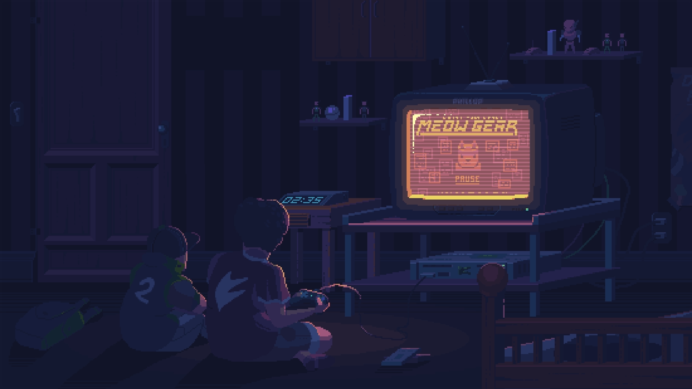

# STARSHIP PROMPT SETUP

 

## INSTALL STARSHIP USING THE LINKS
* [STARSHIP](https://starship.rs/installing/)
* [SNAP STORE](https://snapcraft.io/install/starship/ubuntu)

## PASTEL POWERLINE PRESET/CUSTOM
* [PASTEL POWERLINE](https://starship.rs/presets/pastel-powerline)
* Copy the toml file or download it and paste in `./config/starship.toml`
* Set pastel powerline `starship preset pastel-powerline -o ~/.config/starship.toml`
